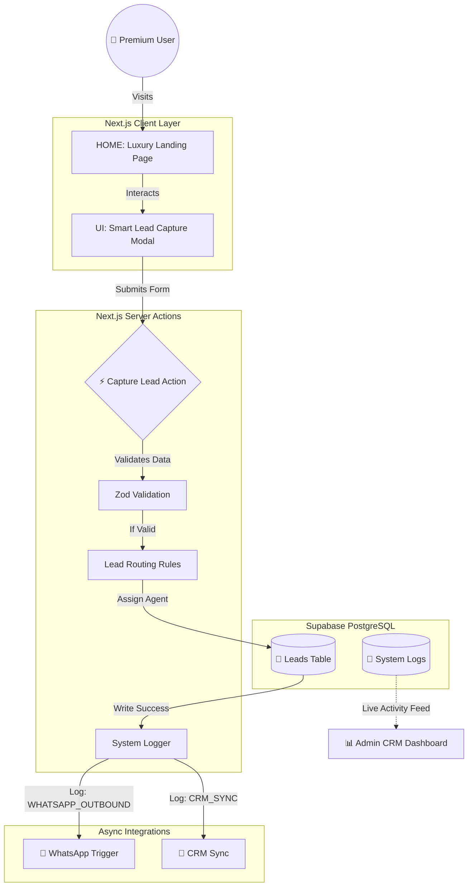

# 🏰 Luxury Real Estate "Sales Machine" - Project Documentation

## 1. Project Overview
**Dubai Prime Estates** is a conversion-first real estate web app built with Next.js that **captures, validates, stores, and routes leads in real time**, then triggers WhatsApp/CRM follow-ups and provides an admin dashboard to monitor pipeline + system health.

It is designed to demonstrate **Full-Stack Ownership**: moving beyond static UI to building a resilient, observable sales engine.

---

## 2. System Architecture & Data Flow

The system employs **Async Integration Patterns** to handle lead processing without improved latency for the user.



### Real vs. Simulated Capabilities

To provide full transparency on the demo's scope:

| Feature | Status | Implementation Details |
| :--- | :--- | :--- |
| **Lead Capture** | ✅ **REAL** | Next.js Server Actions receiving form data. |
| **Data Validation** | ✅ **REAL** | **Zod** schema ensures valid phones/emails before DB write. |
| **Database Storage** | ✅ **REAL** | **Supabase** (PostgreSQL) stores leads per RLS policies. |
| **System Logging** | ✅ **REAL** | Custom `system_logs` table tracks every event. |
| **Admin Dashboard** | ✅ **REAL** | Reads live data from Supabase to show pipeline/logs. |
| **WhatsApp Sending** | ⚠️ *SIMULATED* | Logs the *intent* and payload to DB; API call is mocked. |
| **CRM Sync** | ⚠️ *SIMULATED* | Simulates latency and success response for Salesforce/HubSpot. |

---

## 3. Business Logic & Operations

### Lead Routing Rules (Ownership Example)
The system implements basic "Sales Operations" logic to prioritize leads:
*   **Budget > 20M AED** → Assigned to "Senior Director" (High Priority).
*   **Property Type: Penthouse** → Tagged "VIP" in CRM.
*   **Source: WhatsApp** → 5-minute SLA timer triggered.

### Security & Compliance
*   **Row Level Security (RLS)**: Only authenticated Admins can read leads; Public can only Insert.
*   **Input Sanitization**: Zod strips HTML/SQL injection attempts from text fields.
*   **Rate Limiting**: (Planned) Middleware to block IP flooding on form endpoints.
*   **Data Retention**: Logs auto-expire after 90 days (GDPR compliance pattern).

### Ops & Infrastructure Check
*   **Environment Variables**: Strict separation of secrets (Database Keys) vs Public (Anon Keys). 
*   **Deployment**: CI/CD via Vercel (Push to Main → Production).
*   **Monitoring**: 
    *   **Vercel Analytics** for Real User Monitoring (RUM).
    *   **Custom System Logs** for business logic failures (record not saved, sync failed).
*   **Rollback Strategy**: Instant rollback via Vercel Dashboard in case of regression.

---

## 4. Project Structure

---

## 3. Project Structure

The codebase is organized for scalability using the **Next.js App Router** structure.

```text
luxury-real-estate-demo/
├── app/                        # Next.js App Router (Routes & Pages)
│   ├── admin/                  # Protected Admin Dashboard
│   │   ├── leads/              # Lead Pipeline (Kanban/List)
│   │   └── page.tsx            # Main Dashboard Overview
│   ├── secondary/              # Secondary Market Listings
│   ├── showcase/               # "Demo Showcase" Experience
│   ├── performance/            # Technical Performance Proof
│   ├── api/                    # API Routes (Simulated Endpoints)
│   ├── layout.tsx              # Root Layout (Fonts, Metadata)
│   └── page.tsx                # Homepage (Hero, Features, Contact)
├── components/                 # React UI Components
│   ├── admin/                  # Admin-specific Components (SystemLogs, Guard)
│   ├── ui/                     # Reusable UI (Buttons, Inputs - Shadcn)
│   ├── ContactForm.tsx         # Main Lead Capture Logic
│   ├── DemoShowcase.tsx        # Horizontal Scroll Experience
│   ├── HeroSection.tsx         # High-Impact Entry Section
│   ├── LeadModal.tsx           # Context-Aware Popup Form
│   ├── LuxuryPropertyGrid.tsx  # Property Listings
│   └── Navigation.tsx          # Responsive Navbar
├── actions/                    # Server Actions (Backend Logic)
│   └── capture-lead.ts         # Secure Lead Processing & Logging
├── lib/                        # Utilities & Helpers
│   ├── fake-data.ts            # Mock Types & Data
│   └── utils.ts                # CSS Class Merging
├── public/                     # Static Assets (Images, Icons)
├── supabase/                   # Database Management
│   ├── supabase-leads-final.sql # Schema Definitions
│   └── supabase-logging.sql     # Logging System Setup
├── INFRASTRUCTURE.md           # Operational Manual (DevOps)
├── next.config.js              # Next.js Configuration
├── tailwind.config.ts          # Design System Token Config
└── package.json                # Dependencies
```

---

## 4. Technologies Used

### Frontend Core
*   **Next.js 14 (App Router)**: The framework for server-side rendering and routing.
*   **React 18**: Component-based UI library.
*   **TypeScript**: Ensures type safety and code reliability.

### Styling & Animation
*   **Tailwind CSS**: Utility-first CSS framework for rapid, responsive design.
*   **Framer Motion**: Production-ready animation library (used for complex transitions, horizontal scrolling, and micro-interactions).
*   **Lucide React**: Consistent, lightweight SVG iconography.

### Backend & Database
*   **Supabase (PostgreSQL)**: Scalable relational database with Row Level Security (RLS).
*   **Next.js Server Actions**: Form handling and backend logic execution without separate API servers.
*   **Zod**: Schema validation for robust data integrity (checking phone numbers, emails).

### Infrastructure & DevOps
*   **Vercel**: Edge network deployment for global low latency.
*   **Git**: Version control.
*   **Vercel Analytics**: Real-user monitoring (RUM).

### SEO & Performance
*   **Next.js Metadata API**: Dynamic meta tags and Open Graph support.
*   **JSON-LD**: Structured data for search engine understanding.
*   **Core Web Vitals**: Optimized LCP (Largest Contentful Paint) and CLS (Cumulative Layout Shift).
