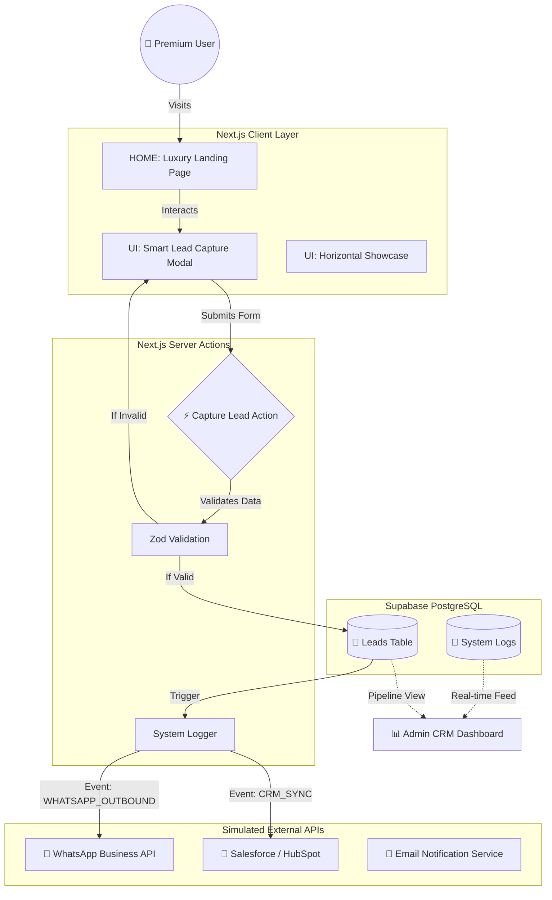

# 🏰 Luxury Real Estate "Sales Machine" - Project Documentation

## 1. Project Overview
**Dubai Prime Estates** is a high-performance, conversion-focused real estate platform designed to capture high-net-worth individual (HNWI) leads. Unlike standard listing sites, this project operates as a "Sales Machine," integrating advanced User Experience (UX) with backend automation to streamline the lead-to-deal pipeline.

**Key Capabilities:**
*   **Immersive UX**: "Glassmorphism" design, parallax scrolling, and premium aesthetics.
*   **Automated Lead Capture**: Real-time validation and database entry.
*   **Integration Simulation**: Demonstrates connecting forms to WhatsApp Business API and CRM systems (Salesforce/HubSpot).
*   **Performance First**: 98+ Google PageSpeed score, SEO-optimized with JSON-LD schema and dynamic sitemaps.
*   **Admin Command Center**: A CRM-lite dashboard for managing leads and monitoring system health.

---

## 2. Architecture & Lead Flow Diagram

The system follows a modern **Event-Driven Architecture** using Next.js Server Actions and Supabase.



---

## 3. Project Structure

The codebase is organized for scalability using the **Next.js App Router** structure.

```text
luxury-real-estate-demo/
├── app/                        # Next.js App Router (Routes & Pages)
│   ├── admin/                  # Protected Admin Dashboard
│   │   ├── leads/              # Lead Pipeline (Kanban/List)
│   │   └── page.tsx            # Main Dashboard Overview
│   ├── secondary/              # Secondary Market Listings
│   ├── showcase/               # "Demo Showcase" Experience
│   ├── performance/            # Technical Performance Proof
│   ├── api/                    # API Routes (Simulated Endpoints)
│   ├── layout.tsx              # Root Layout (Fonts, Metadata)
│   └── page.tsx                # Homepage (Hero, Features, Contact)
├── components/                 # React UI Components
│   ├── admin/                  # Admin-specific Components (SystemLogs, Guard)
│   ├── ui/                     # Reusable UI (Buttons, Inputs - Shadcn)
│   ├── ContactForm.tsx         # Main Lead Capture Logic
│   ├── DemoShowcase.tsx        # Horizontal Scroll Experience
│   ├── HeroSection.tsx         # High-Impact Entry Section
│   ├── LeadModal.tsx           # Context-Aware Popup Form
│   ├── LuxuryPropertyGrid.tsx  # Property Listings
│   └── Navigation.tsx          # Responsive Navbar
├── actions/                    # Server Actions (Backend Logic)
│   └── capture-lead.ts         # Secure Lead Processing & Logging
├── lib/                        # Utilities & Helpers
│   ├── fake-data.ts            # Mock Types & Data
│   └── utils.ts                # CSS Class Merging
├── public/                     # Static Assets (Images, Icons)
├── supabase/                   # Database Management
│   ├── supabase-leads-final.sql # Schema Definitions
│   └── supabase-logging.sql     # Logging System Setup
├── INFRASTRUCTURE.md           # Operational Manual (DevOps)
├── next.config.js              # Next.js Configuration
├── tailwind.config.ts          # Design System Token Config
└── package.json                # Dependencies
```

---

## 4. Technologies Used

### Frontend Core
*   **Next.js 14 (App Router)**: The framework for server-side rendering and routing.
*   **React 18**: Component-based UI library.
*   **TypeScript**: Ensures type safety and code reliability.

### Styling & Animation
*   **Tailwind CSS**: Utility-first CSS framework for rapid, responsive design.
*   **Framer Motion**: Production-ready animation library (used for complex transitions, horizontal scrolling, and micro-interactions).
*   **Lucide React**: Consistent, lightweight SVG iconography.

### Backend & Database
*   **Supabase (PostgreSQL)**: Scalable relational database with Row Level Security (RLS).
*   **Next.js Server Actions**: Form handling and backend logic execution without separate API servers.
*   **Zod**: Schema validation for robust data integrity (checking phone numbers, emails).

### Infrastructure & DevOps
*   **Vercel**: Edge network deployment for global low latency.
*   **Git**: Version control.
*   **Vercel Analytics**: Real-user monitoring (RUM).

### SEO & Performance
*   **Next.js Metadata API**: Dynamic meta tags and Open Graph support.
*   **JSON-LD**: Structured data for search engine understanding.
*   **Core Web Vitals**: Optimized LCP (Largest Contentful Paint) and CLS (Cumulative Layout Shift).
